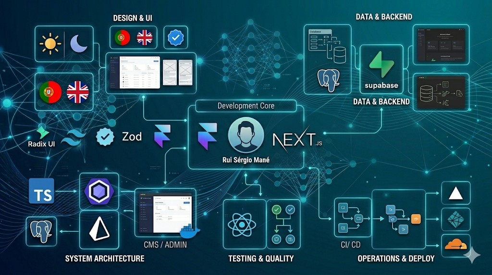

# RuiSergio.dev Portfolio



Portfolio profissional desenvolvido com Next.js para apresentar perfil, experiencia, skills e projetos, com foco em design moderno, performance e boa experiencia de utilizacao.

## Preview

- **Projeto**: `ruisergio.dev-portafolio`
- **Stack principal**: Next.js, React, TypeScript, Tailwind CSS, Framer Motion
- **Recursos**: tema claro/escuro, multi-idioma, secao administrativa e integracao com Supabase

## Funcionalidades

- Landing page moderna com secoes de:
  - Sobre
  - Skills
  - Experiencia
  - Projetos
  - Contacto
- Navegacao responsiva (desktop e mobile)
- Tema claro/escuro com persistencia
- Internacionalizacao (PT/EN)
- Painel admin para gestao de projetos
- Integracao com Supabase (cliente, servidor e middleware)
- Favicon e identidade visual personalizados

## Tecnologias

- **Framework**: Next.js 16
- **UI**: React 19 + Tailwind CSS 4 + Radix UI
- **Animacoes**: Framer Motion
- **Backend/BaaS**: Supabase
- **Validacao/Formularios**: Zod + React Hook Form
- **Qualidade**: TypeScript + ESLint

## Estrutura do projeto

```text
app/
  page.tsx                  # pagina principal
  layout.tsx                # metadata global, providers e icones
  admin/                    # area administrativa
components/
  portfolio/                # secoes publicas do portfolio
  admin/                    # componentes do painel admin
  ui/                       # biblioteca de componentes reutilizaveis
lib/
  supabase/                 # clientes Supabase (browser/server/middleware)
  translations.ts           # textos e traducao PT/EN
public/
  icon.svg                  # favicon/logomarca
```

## Como executar localmente

### 1) Clonar o repositorio

```bash
git clone https://github.com/SEU-USUARIO/ruisergio.dev-portafolio.git
cd ruisergio.dev-portafolio
```

### 2) Instalar dependencias

```bash
npm install
```

### 3) Configurar variaveis de ambiente

Crie um ficheiro `.env.local` na raiz do projeto:

```env
NEXT_PUBLIC_SUPABASE_URL=your_supabase_url
NEXT_PUBLIC_SUPABASE_ANON_KEY=your_supabase_anon_key
```

### 4) Iniciar em desenvolvimento

```bash
npm run dev
```

A aplicacao ficara disponivel em `http://localhost:3000`.

## Scripts disponiveis

- `npm run dev` - inicia o ambiente de desenvolvimento
- `npm run build` - gera build de producao
- `npm run start` - inicia a app em modo producao
- `npm run lint` - executa analise de codigo com ESLint

## Deploy

Este projeto pode ser publicado em:

- Vercel (recomendado para Next.js)
- Netlify
- Cloudflare Pages

### Deploy na Vercel

1. Importar o repositorio no painel da Vercel
2. Definir as variaveis de ambiente
3. Executar deploy

## Personalizacao rapida

- **Textos e traducao**: `lib/translations.ts`
- **Cabecalho e navegacao**: `components/portfolio/header.tsx`
- **Hero section**: `components/portfolio/hero.tsx`
- **Rodape**: `components/portfolio/footer.tsx`
- **Estilos globais**: `app/globals.css`

## Autor

**Rui Sergio Mane**

- Portfolio: `ruisergio.dev` (quando publicado)
- GitHub: `https://github.com/SEU-USUARIO`

## Licenca

Este projeto esta disponivel para uso pessoal/profissional.
Se desejares abrir como open-source, recomenda-se adicionar uma licenca formal (ex.: MIT).
